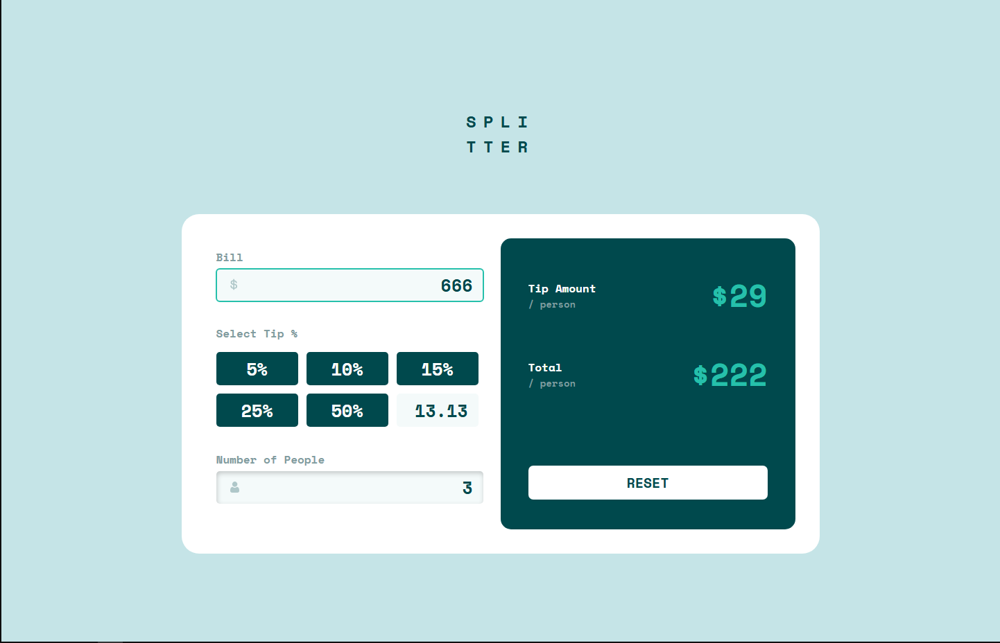

# Frontend Mentor - Tip calculator app solution

This is a solution to the [Tip calculator app challenge on Frontend Mentor](https://www.frontendmentor.io/challenges/tip-calculator-app-ugJNGbJUX). Frontend Mentor challenges help you improve your coding skills by building realistic projects.

## Table of contents

- [Overview](#overview)
  - [The challenge](#the-challenge)
  - [Screenshot](#screenshot)
  - [Links](#links)
- [My process](#my-process)
  - [Built with](#built-with)
  - [What I learned](#what-i-learned)
  - [Useful resources](#useful-resources)
- [Author](#author)
- [Acknowledgments](#acknowledgments)

## Overview

### The challenge

Users should be able to:

- View the optimal layout for the app depending on their device's screen size
- See hover states for all interactive elements on the page
- Calculate the correct tip and total cost of the bill per person

### Screenshot

### Links

- Solution URL: [Tip-calc-pro on my GitHub page](https://github.com/AssafBenIshay/tip-calc-pro)
- Live Site URL: [tip-calc-pro.vercel.app](https://tip-calc-pro.vercel.app/)

## My process

### Built with

- Semantic HTML5 markup
- CSS custom properties
- Flexbox
- CSS Grid
- [Vue](https://vuejs.org/) - JS library
- [Vuex](https://vuex.vuejs.org/) - VueX State Managment

### What I learned

That i like React Better, 

### Useful resources

- [Vue](https://vuejs.org/guide/quick-start.html#local) - first run on this framework,documentation is awesome.
- [VueScool](https://vueschool.io/) - best source of video learning.
- [VueX](https://vuex.vuejs.org/) - also here awesom documentation.
- [Vuex with Scrimba](https://scrimba.com/learn-vuex-c01s) - realy helped me getting started with state management

## Author

- Website - [Assaf Ben Ishay](https://ben-ishay-assaf.vercel.app/)
- Frontend Mentor - [@yourusername](https://www.frontendmentor.io/profile/yourusername)
- Twitter - [@yourusername](https://www.twitter.com/yourusername)

